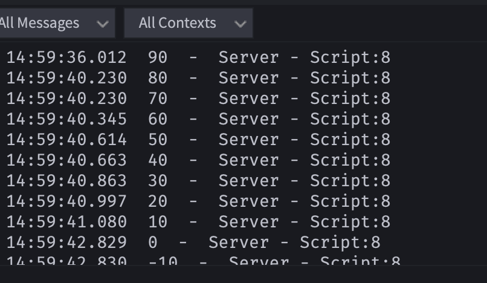

この記事は、岩手県八幡平市のプログラミング教室「アクセルキャンプ」の公開教材です。
[アクセルキャンプ(フリースペースプラウド)のリンク](https://freespaceproud.com)
教材の作成依頼等も承っております。ご意見等は、リンク先の問い合わせ欄からお願いします。
教材の転用・利用等は自由ですが、コメント等で一声いただけますと幸いです。   

------------------------------------------------------------------------
# Roblox Lua 基礎① 変数とデータ

# Lua( Luau ) について
**lua**はプログラミング言語で、ゲーム開発に限らず、世の中のいろんな便利なツールで使われているもの。 **luau** とは、それをrobloxでプログラミングするのに便利になるように改良したもの。
みんながこれから勉強していくものの一部は正確に言うとluauなんだけど、このシリーズの中ではluaとして統一するよ。

以下のリンクはluaの細かい仕様が書いてある。最初は意味不明な言葉の羅列に感じるかもだけど、なにかわからないときに見てみると解決するかも。
[lua公式ドキュメント(日本語)](https://inzkyk.xyz/lua_5_4/)
[roblox クリエイターハブ](https://create.roblox.com/landing)
[luau ドキュメント(roblox クリエイターハブ)]([https://](https://create.roblox.com/docs/ja-jp/luau)


# 変数とデータ

------------------------------------------------------------------------

## 🎯 今日の目標

-   変数とは何かを理解する
-   数字・文字・真偽値の違いを知る
-   Roblox Studio で実際に動かしてみる

------------------------------------------------------------------------

# 1. 変数ってなに？

## ✅ 変数とは

> 「データを入れておく箱」のこと

robloxのゲーム制作に限らず、プログラミングではいろんなデータに名前をつける必要がある。

例： - プレイヤーのHP - スコア - 名前 - レベル

それを保存して、使い回しができるように **変数** を使う。

------------------------------------------------------------------------

# 2. 変数の作り方(宣言)

Luaでは、こんな感じで書く

``` lua
local 変数名 = データ
```

例：

``` lua
local score = 100
```
これで、**｢100という数字にscoreという名前をつけたから、これ以降scoreと言ったら数字の100のことだからヨロシク!｣** ということになったわけ。

------------------------------------------------------------------------

# 3. データの種類
luaで扱うデータにはいろんな種類のものがある。その中でも一番使う奴らを紹介するぜ。

## ① 数字（number）
プログラミング中はめちゃくちゃいろんなものを計算することになる。ダメージ計算とか、軌道計算とか。数値を扱う型のことを **数値型 / number型** っていう。

number型のデータは、こんな感じで計算することができる。
``` lua
local hp = 50
local damage = 10

hp = hp - damage

print(hp)  -- 40 と表示される
```

------------------------------------------------------------------------

## ② 文字（string）
画面に表示するメッセージを決めたりするときに、**文字列型 / string型** というデータを使う。
例えばこんなの

``` lua
local player_name = "ricky"
local game_name = "リッキーゲーム"

print(player_name)  -- ricky
print(game_name)  -- リッキーゲーム
```

文字をつなげる：文字列同士連結するには、 ' .. ' で繋げればできる
※別のプログラミング言語みたいに、 + で繋いだりはできない

``` lua
local player_name = "ricky"
local game_name = "リッキーゲーム"
local greeting = player_name .. "さん、" .. game_name .. "へようこそ!"

print(greeting)  -- rickyさん、リッキーゲームへようこそ!
```

------------------------------------------------------------------------

## ③ 真偽値（boolean / ブール型）
｢そうだよ/true｣ と｢ちがうよ/false｣の2種類のデータを扱うデータ型
コレを使って、プレイヤーの状態(行きてるかシンでるか)などを判定したりする

``` lua
-- ゲームオーバーかどうかを判定する
local isAlive = true
local isGameOver = false

print(isAlive)
```

使用例：

``` lua
local rickyIsIkemen = true
local rickyIsBusaiku = false

-- もしリッキ先生がイケメンなら、｢そうだよね｣と表示
if rickyIsIkemen then
    print("そうだよね")
end
```

------------------------------------------------------------------------

# 4. 実験コード
まず、これを実行したらどうなるか予想してから実行してみよう
``` lua
local playerName = "Hero"
local hp = 100
local damage = 30

hp = hp - damage

print("プレイヤー名: " .. playerName)
print("残りHP: " .. hp)
```
<details><summary>実行結果</summary>

```
プレイヤー名: Hero
残りHP: 70
```
</details>

------------------------------------------------------------------------

# 5. まとめ

|  データの種類      |  例              |  説明         |
|  --------------  |  --------------  |  --------------  |
|  number         |100            |数字|
|  string         |"Hello"        |文字|
|  boolean        |true / false   |本当かどうか|

------------------------------------------------------------------------

# 5. Roblox Studioでやってみよう。
partsの中にscriptを用意して、partsに触れたらダメージを食らうようにしてみよう。
まずは、ブロックに触れたら中のコードが実行される仕組みを先に書くと、こんな感じになる(これからめちゃくちゃ使うから、覚えちゃおう)
```lua
local part = script.Parent

local function onTouch(hit)
    -- ここにさわったときやることを書く
end

part.Touched:Connect(onTouch)
```
コメントの部分にluaプログラムを書いて、出力パネルにこんな感じの出力が出たらOK

# 🎮 ミニチャレンジ

1.  自分の名前を変数に入れて表示してみよう\
2.  HPを200にして、50ダメージ与えて表示してみよう\
3.  true / false を使ってドアの状態を作ってみよう
