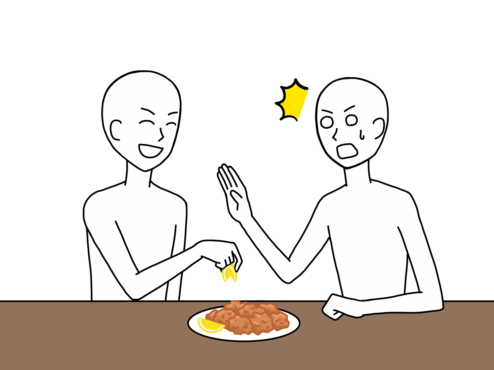

この記事は、岩手県八幡平市のプログラミング教室「アクセルキャンプ」の公開教材です。
[アクセルキャンプ(フリースペースプラウド)のリンク](https://freespaceproud.com)
教材の作成依頼等も承っております。ご意見等は、リンク先の問い合わせ欄からお願いします。
教材の転用・利用等は自由ですが、コメント等で一声いただけますと幸いです。  

------------------------------------------------------------------------
# Roblox Lua 基礎⑤ 関数(function)
関数と聞くと、数学の二次関数とかを思い浮かべる人も多いと思う(先生は根っからの文系人間なので聞くたびに蕁麻疹が出そう)。
プログラミングの関数は数学と似てるところもあれば、違うところもある感じ。関数が使えるようになると、書けるコードが一気にプログラマーっぽくなってくる。カッコイイコードを書けるようになろうぜ。

------------------------------------------------------------------------

## 🎯 今日の目標

- 関数とは何かを理解する  
- 同じ処理をまとめて書けるようになる  
- Robloxでよく使う「処理の部品化」を体験する  

------------------------------------------------------------------------

# 1. 関数とは
関数を一口で説明すると｢複数の処理で、よく使うものをまとめて、名前をつける｣
名前をつける部分は**変数**も似てるけど、変数は単なるデータに名前をつけるのに対して、関数は｢機能｣に名前をつける。

例えば、｢唐揚げをつくるロボット｣に、プログラムを渡すとする。やってもらいたい処理は
```
冷蔵庫を開ける
材料を出す
鶏もも肉を一口大に切る
醤油・しょうが（チューブOK）をもみ込む
片栗粉をまぶす
油でカラッと揚げる
お皿に盛る
レモンをかける
```

唐揚げマニアな先生は朝･昼･晩3回唐揚げを食べるので、一日に動かすプログラムはこんな感じになる
```lua
-- 朝
冷蔵庫を開ける
材料を出す
鶏もも肉を一口大に切る
醤油・しょうが（チューブOK）をもみ込む
片栗粉をまぶす
油でカラッと揚げる
お皿に盛る
レモンをかける

-- 昼
冷蔵庫を開ける
材料を出す
鶏もも肉を一口大に切る
醤油・しょうが（チューブOK）をもみ込む
片栗粉をまぶす
油でカラッと揚げる
お皿に盛る
レモンをかける

-- 夜
冷蔵庫を開ける
材料を出す
鶏もも肉を一口大に切る
醤油・しょうが（チューブOK）をもみ込む
片栗粉をまぶす
油でカラッと揚げる
お皿に盛る
レモンをかける
```

## ①唐揚げ関数をつくろう : 関数定義･呼び出し
この唐揚げプログラムを、関数を使って書いてみるとこんな感じになる(当然、本物のコードではないので、動かない)

```lua
-- ①定義
function Karaage()
    冷蔵庫を開ける
    材料を出す
    鶏もも肉を一口大に切る
    醤油・しょうが（チューブOK）をもみ込む
    片栗粉をまぶす
    油でカラッと揚げる
    お皿に盛る
    レモンをかける
end

-- ②呼び出し
Karaage()
Karaage()
Karaage()
```
冷蔵庫を開ける~レモンをかける、までの処理に対して｢Karaage｣という名前をつけたわけで、**これ以降Karaageと言ったら、冷蔵庫を開ける→レモンをかける、のことだよ** という宣言をしたのが、**①定義**の部分。
その定義の部分を見ながら、｢あ、この機能使いたい｣という感じで、**用意されている機能を使う**のが**②呼び出し** の部分

関数にまとめることで、何回も書かなくても、何度でも機能を使えるようになった

## ②唐揚げ機能を使いやすくしよう : 引数(ひきすう)
この関数には、重大な問題がある。一つ間違えれば我々日本人の間で戦争を引き起こしかねない問題が。

### 勝手にレモンかけてんじゃねーよ
と、先生と志を同じくする多くの諸君は思っただろう。一滴でもレモンを無断でかけようものなら、それはもう我々に対する戦線布告だ。
というのは冗談だけど、この関数を使う限りは必ずレモンをかけられてしまうという問題がある。
コレを解決するために、｢レモンをかける｣の処理を外したバージョンを作ってもいい。そうすると、こういう感じになる
```lua
-- ①定義
-- 唐揚げ関数:レモンかけるバージョン
function Karaage_with_lemon()  --with : ｢付き｣
    冷蔵庫を開ける
    材料を出す
    鶏もも肉を一口大に切る
    醤油・しょうが（チューブOK）をもみ込む
    片栗粉をまぶす
    油でカラッと揚げる
    お皿に盛る
    レモンをかける
end

-- 唐揚げ関数:レモンかけないバージョン
function Karaage_no_lemon()
    冷蔵庫を開ける
    材料を出す
    鶏もも肉を一口大に切る
    醤油・しょうが（チューブOK）をもみ込む
    片栗粉をまぶす
    油でカラッと揚げる
    お皿に盛る
    -- ｢レモンをかける｣を削除
end


-- ②呼び出し
-- 朝:かけない
Karaage_no_lemon()
-- 昼:レモンかける派の女の子とデートだから、仕方なくかける
Karaage_with_lemon()
-- 夜:かけない
Karaage_no_lemon()
```
これでうまくいくようにも見えるけど、中には唐揚げにマヨネーズかける人もいれば、醤油をかけたい人もいる。
何より、関数が2つあるのが煩わしい。
｢似たような機能なんだから、なんかこう、1つにならないもんかな｣というのは、とてもプログラマーっぽい思考で👍
こういうときに役に立つのが、**引数**という機能。
レモンをかけるのかどうかという情報を、唐揚げ関数に渡して、それを関数内で処理することができれば、どっちにも対応できる関数を作ることができる。この関数に渡す情報のことを、引数という
luaで書いてみると、こんな感じ
```lua
-- lemonという引数を受け取る
function Karaage(lemon)
    冷蔵庫を開ける
    材料を出す
    鶏もも肉を一口大に切る
    醤油・しょうが（チューブOK）をもみ込む
    片栗粉をまぶす
    油でカラッと揚げる
    お皿に盛る
    -- lemonがtrueだったときだけ、レモンをかける。そうじゃないときは何もしない
    if lemon == true then
        レモンをかける
    end
end

-- ②呼び出し
-- 朝:かけない
Karaage(false)
-- 昼:レモンかける派の女の子とデートだから、仕方なくかける
Karaage(true)
-- 夜:かけない
Karaage(false)
```
この例では、関数を呼び出すときにtrueまたはfalseのデータを引数としてKaraage関数に渡している。Karaage関数の中では、渡された引数はlemonという名前で扱って、それがtrueなのかfalseなのかで処理を変えている。


## ③さあ、食べよう : 戻り値
せっかく出来上がった唐揚げを食べるのを忘れてたので、｢食べる｣の機能を入れよう。
例えばここに｢たべる｣をいれるとどうだろう
```lua
-- lemonという引数を受け取る
function Karaage(lemon)
    冷蔵庫を開ける
    材料を出す
    鶏もも肉を一口大に切る
    醤油・しょうが（チューブOK）をもみ込む
    片栗粉をまぶす
    油でカラッと揚げる
    お皿に盛る
    -- lemonがtrueだったときだけ、レモンをかける。そうじゃないときは何もしない
    if lemon == true then
        レモンをかける
    end
    たべる -- ここで食べる?
end

-- ②呼び出し
-- 朝:かけない
Karaage(false)
-- 昼:レモンかける派の女の子とデータだから、仕方なくかける
Karaage(true)
-- 夜:かけない
Karaage(false)
```
これでも、一連の処理として｢食べる｣が入っているので、機能としては問題なさそう。
でも、ちょっと待って、おしゃれなレストランに言ったときや◯ターバックスに言ったとき、出てきたものをすぐ食べずに、写真を撮ったり、インスタに上げたりするよね。このままだと、お腹は一杯になるかもしれないけど、唐揚げでいろんな楽しみ方をすることができない!

唐揚げ関数には唐揚げを作るまでをやってもらって、出来上がった唐揚げはこっちにもらって、写真を撮るなりインスタに上げるなりしたいよね、というときに役に立つのが**戻り値**の機能。こんな感じで、唐揚げ関数にお願いして出来上がった唐揚げを受け取ることができる

```lua
function Karaage(lemon)
    冷蔵庫を開ける
    材料を出す
    鶏もも肉を一口大に切る
    醤油・しょうが（チューブOK）をもみ込む
    片栗粉をまぶす
    油でカラッと揚げる
    お皿に盛る
    -- lemonがtrueだったときだけ、レモンをかける。そうじゃないときは何もしない
    if lemon == true then
        レモンをかける
        return レモンのかかった唐揚げ
    else 
        return レモンのかかってない唐揚げ
    end
end

-- ②呼び出し
-- 朝:かけない
Karaage(false)をインスタに上げる    -- レモンのかかってない唐揚げをインスタに上げる
-- 昼:レモンかける派の女の子とデートだから、仕方なくかける
Karaage(true)の写真をとる        -- レモンのかかった唐揚げの写真を撮る
-- 夜:かけない
Karaage(false)をたべる            -- レモンのかかってない唐揚げをたべる
```
---


さて、本格的に関数の書き方をやる前に、今のままではレモンしかかけられないという問題があるから、いろんなものをかけられるようにするにはどうしたらいいか、考えてみよう。
みんなは何をかける派?
<details><summary>例</summary>

```lua
-- lemonという引数を受け取る
function Karaage(kakerumono)
    冷蔵庫を開ける
    材料を出す
    鶏もも肉を一口大に切る
    醤油・しょうが（チューブOK）をもみ込む
    片栗粉をまぶす
    油でカラッと揚げる
    お皿に盛る
    -- lemonがtrueだったときだけ、レモンをかける。そうじゃないときは何もしない
    if kakerumono == "" then
        なにもかけない
    else 
        kakerumonoをかける
    end

end

-- ②呼び出し
-- 朝:かけない
Karaage("醤油")
-- 昼:レモンかける派の女の子とデータだから、仕方なくかける
Karaage("レモン")
-- 夜:かけない
Karaage("マヨネーズ")
```
</details>


------------------------------------------------------------------------

# 2. 関数の基本形 : 関数定義
```lua
function 関数名()
    -- ここに処理を書く
end
```

例：

```lua
function sayHello()
    print("こんにちは！")
end
```
気をつけなくては行けないのは。**関数は定義しただけでは実行されない**ということ。定義した関数は、使わないと実行されない。


------------------------------------------------------------------------


# 3. 関数を使う = 呼び出す
```lua
sayHello()
sayHello()
```

出力結果：

```
こんにちは！
こんにちは！
```
引数を与えない場合でも、呼び出す際に()は必要


------------------------------------------------------------------------

# 4. 関数にデータを渡す : 引数
関数に **データを渡す** ことができる。  
このとき使うのが **引数**。

```lua
function sayHello(name)
    print("こんにちは、" .. name)
end

sayHello("たろう")
sayHello("はなこ")
```

### 引数を複数渡したいとき
カンマで区切ってデータを渡すことができる
```lua
function sayHello(name, message)
    print("こんにちは、" .. name .. "。".. message)
end

sayHello("たろう", "今日もかっこいいね")
sayHello("はなこ", "今日もかわいいね")
```

------------------------------------------------------------------------

# 5. 呼び出し元にデータを返す : 戻り値 

関数は **結果を返す** こともできる。

```lua
function add(a, b)
    return a + b
end

local result = add(3, 5)
print(result)
```

コレを実行すると呼び出したところ、つまり`add(3, 5)` の部分は、その結果の`8`になる。

------------------------------------------------------------------------

# 6. 実験コード
まず、これを実行したらどうなるか予想してから実行してみよう
``` lua
function giveDamage(hp, damage)
    hp = hp - damage

    if hp < 0 then
        hp = 0
    end
    return hp
end

print(giveDamage(100, 20))
```
<details><summary>実行結果</summary>

```
80
```
</details>

------------------------------------------------------------------------

# 7. Roblox Studioでやってみよう

触れたら関数を使ってダメージを与えるブロックを作ってみよう。
```lua
local part = script.Parent

-- ここでgiveDamage関数を定義しよう

local function onTouched(hit)
    local character = hit.Parent
    if not character then return end

    local humanoid = character:FindFirstChildOfClass("Humanoid")
    if not humanoid then return end

    giveDamage(humanoid, 40)
    print("残りHP: " .. humanoid.Health)
end

part.Touched:Connect(onTouched)
```

<details><summary>例</summary>


```lua
local part = script.Parent

function giveDamage(humanoid, damage)
    local hp = humanoid.Health
    hp = hp - damage

    if hp < 0 then
        hp = 0
    end

    humanoid.Health = hp
end

local function onTouched(hit)
    local character = hit.Parent
    if not character then return end

    local humanoid = character:FindFirstChildOfClass("Humanoid")
    if not humanoid then return end

    giveDamage(humanoid, 40)
    print("残りHP: " .. humanoid.Health)
end

part.Touched:Connect(onTouched)
```
</details>

------------------------------------------------------------------------

# 8. まとめ

- 関数は処理をまとめるためのもの  
- 引数でデータを受け取れる  
- return で結果を返せる  
- Robloxでは関数を使うとコードがすっきりする  

------------------------------------------------------------------------

# 🎮 チャレンジ

1. 回復する関数 `heal(humanoid, amount)` を作ってみよう  
2. ダメージ量を変えられるようにしてみよう  
3. HPが0のときはダメージを与えないようにしてみよう  
